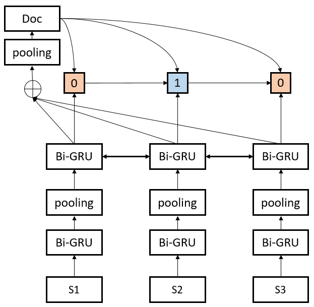
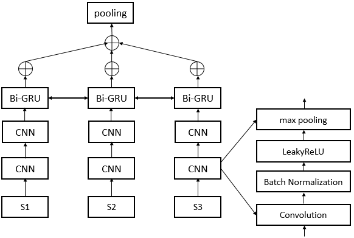
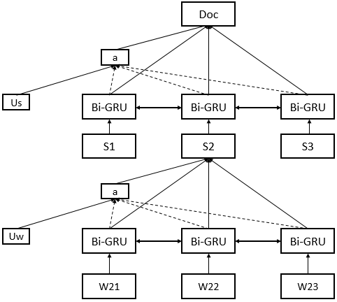

## The PyTorch Implementation Of SummaRuNNer

[](https://opensource.org/licenses/MIT)
### Models
<div  align="center">

</div>

<div  align="center">

</div>

<div  align="center">

</div>

### Setup

Requires [pipenv](https://docs.pipenv.org/). Use `pip install pipenv` if not installed.

```
pipenv install
pipenv shell
```

### Usage  

```shell
# train
python main.py -device 0 -batch_size 32 -model RNN -seed 1 -save_dir checkpoints/XXX.pt
# test
python main.py -test -model RNN -load_dir checkpoints/XXX.pt

```
### Result

#### DailyMail(75 bytes)  

| model  | ROUGE-1   | ROUGE-2 | ROUGE-L |
| ------ | :-----:   | :----:  | :----:  |
|SummaRNNer(Nallapati)|26.2|10.8|14.4|
|RNN-RNN|26.0|11.4|13.8|
|CNN-RNN|25.6|11.3|13.8|
|Hierarchical Attn Net|26.1|11.5|13.8|

### Blog

+ [用PyTorch搭建抽取式摘要系统](http://mp.weixin.qq.com/s/9X77MPcQOQPwZaOVIVfo9Q)

### Download Data:  

+ 百度云:[https://pan.baidu.com/s/1LV3iuuH1NjxuAJd0iz14lA](https://pan.baidu.com/s/1LV3iuuH1NjxuAJd0iz14lA) 密码:`ivzl`

+ Google Driver:[data.tar.gz](https://drive.google.com/file/d/1JgsboIAs__r6XfCbkDWgmberXJw8FBWE/view?usp=sharing)

+ Source Data:[Neural Summarization by Extracting Sentences and Words](https://docs.google.com/uc?id=0B0Obe9L1qtsnSXZEd0JCenIyejg&export=download)

### Evaluation

+ [Tools](https://github.com/hpzhao/nlp-metrics)

### Acknowledge

+ Thanks for @[AlJohri](https://github.com/AlJohri)'s contribution
